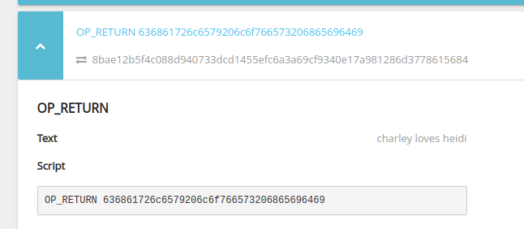

# Test Asset Integration Engineer - Exodus
## Requirements & Rules
- [ ] time limit: 8 hours
- [ ] store Bitcoin OP_RETURN data
- [ ] index Bitcoin OP_RETURN data
- [ ] serve on an HTTP endpoint as a JSON payload: `/opreturn/${opReturnData}`
- [x] payload should include transaction hash and block hash
- [x] NodeJS
- [x] any 3rd-party npm library
- [x] Postgres as database
- [x] Bitcoin ~~mainnet~~ or testnet
- [x] use bitcoind

### Example
Transaction [8bae12b5f4c088d940733dcd1455efc6a3a69cf9340e17a981286d3778615684](https://www.smartbit.com.au/tx/8bae12b5f4c088d940733dcd1455efc6a3a69cf9340e17a981286d3778615684) has `OP_RETURN` 636861726c6579206c6f766573206865696469 that decoded leads to "charley loves heidi".


## Getting started
Requirements:
- yarn
- postgres
- nodeJS
1. Install dependencies: `cd <db|indexer|json-api> && yarn`
2. Set up DB
    - Requirements: PostgreSQL
    - Create `opreturn` DB:
      ```
      sudo su - postgres
      psql
      ALTER USER r1oga WITH PASSWORD 'exodus'; # change user and pwd
      \q
      exit
      psql -d postgres
      CREATE DATABASE opreturn;
      # check DB was created:
      \l
      ```
2. Start json-api: `cd json-api && yarn start`
3. Run tests in respective packages/folders: `yarn test`

## DB Schema
|Column|Type|
|--|--|
|op_return|bytes|
|blockHash|string|
|blockHeight|integer|
|txHash|string|

## API
### Route
|METHOD|ROUTE|RESPONSE||
|--|--|--|--|
|GET|/opreturn/:blockHeight|opReturn record||
|GET|/opreturn/:blockHash|opReturn record||
|GET|/opreturn/:opreturnHex|opReturn record|TO DO|

## Still To Do

## Resource
- How to read read raw OP_RETURN data from blocks: refactored version of functions found in [blockai-unofficial/raw-op-return](https://github.com/blockai-unofficial/raw-op-return)

