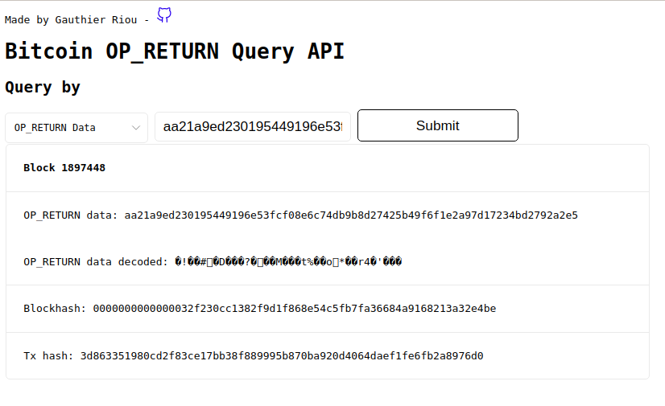

# Test Asset Integration Engineer - Exodus
## Features
- [x] store Bitcoin OP_RETURN data
- [x] index Bitcoin OP_RETURN data
- [x] serve on an HTTP endpoint as a JSON payload
- [x] payload includes transaction hash and block hash
- [x] NodeJS
- [x] any 3rd-party npm library
- [x] Postgres as database
- [x] Bitcoin ~~mainnet~~ or testnet
- [x] use bitcoind

## Built with
- NodeJS
- [node-postgres](https://node-postgres.com/), [sequelize](https://sequelize.org/)
- [bitcoin-core](https://github.com/ruimarinho/bitcoin-core), [bitcoin RPC API](https://developer.bitcoin.org/reference/rpc/index.html)
- [ExpressJS](https://expressjs.com/)
### Example
Transaction [8bae12b5f4c088d940733dcd1455efc6a3a69cf9340e17a981286d3778615684](https://www.smartbit.com.au/tx/8bae12b5f4c088d940733dcd1455efc6a3a69cf9340e17a981286d3778615684) has `OP_RETURN` 636861726c6579206c6f766573206865696469 that decoded leads to "charley loves heidi".


## Getting started
Requirements: yarn, postgres, nodeJS/npm
1. Run a bitcoin-core client. See config [bitcoin.conf](./bitcoin.conf).  
  Especially pay attention to the `rpcworkqueue` setting to avoid the following error (in debug.log file). I haven't run into errors by setting it to 500.
    ```
    WARNING: request rejected because http work queue depth exceeded, it can be increased with the -rpcworkqueue= setting
    ```
1. Install packages dependencies: `cd <db|indexer|json-api> && yarn`
2. Set up DB
    - Requirements: PostgreSQL
    - Create `opreturn` DB:
      ```
      sudo su - postgres
      psql
      ALTER USER r1oga WITH PASSWORD 'r1oga'; # change user and pwd
      \q
      exit
      psql -d postgres
      CREATE DATABASE opreturn;
      # check DB was created:
      \l
      ```
2. Check config settings in [db/config.ts](./db/config.ts) and [indexer/config.ts](./indexer/config.ts).
  Default:
    ```
      postgres:
        host: 'localhost',
        dialect,
        db: 'opreturn',
        username: 'r1oga',
        password: 'exodus'
      bitcoind:
        host: '127.0.0.1', // default
        username: 'r1oga',
        password: 'exodus',
        port: 8332 // default
    ```
2. Index blocks: `cd indexer && yarn start`
2. Start json-api: `cd json-api && yarn start`. Access at [http://localhost:3001/](http://localhost:3001/)
3. Start front-end: `cd front-end && yarn start`. Access at [http://localhost:3000/](http://localhost:3000/)

## Tests: `yarn test` (in respective packages/folders:)

## DB Schema
|Column|Type|Description|
|--|--|--|
|data|TEXT|OP RETURN data|
|blockHash|TEXT|
|blockHeight|INTEGER|
|txHash|TEXT|txid|

## API
### Routes
|METHOD|ROUTE|PAYLOAD|
|--|--|--|
|GET|/opreturn/blockheight/:blockHeight||
|POST|/opreturn/blockheight/:blockHeight|{from: number, to: number}|
|GET|/opreturn/blockhash/:blockHash||
|GET|/opreturn/data/:data||

## Demo




## Resource
- How to read read raw OP_RETURN data from blocks: refactored version of functions found in [blockai-unofficial/raw-op-return](https://github.com/blockai-unofficial/raw-op-return)

